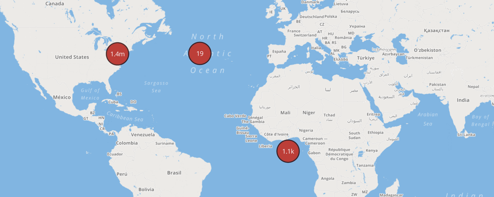

# Data transformation

The "ACCIDENT DATE" column has been split into its "DAY","MONTH" and "YEAR" counterparts in order to make it easily accessible. This data set is then converted into subgroups and saved as jsons for the interactive D3 plots at [github/karth2512](https://github.com/karth2512/EDAV-INTERACTIVE).  

High-level spatial mapping in Plotly



There are certain latitudes and longitudes that are not part of the state of new york but are still part of this dataset. Since our analysis is only related to NYC, we drop these values by crosschecking the lat-longs with the boundaries of NYC.

```{r message=FALSE, warning=FALSE}
# MAIN CLEANED DATA
data <- subset(data, (LATITUDE >= 40.496942  & LONGITUDE >= -74.258905 & LATITUDE <= 40.882507  & LONGITUDE <= -73.789791))

missing_data <- data <- subset(data,  is.na(LATITUDE) | is.na(LONGITUDE) | (LATITUDE >= 40.496942  & LONGITUDE >= -74.258905 & LATITUDE <= 40.882507  & LONGITUDE <= -73.789791))
```

We create a subset by sampling 50,000 rows from the original data. This specificly comes in handy when the original dataset is unwieldy.
```{r message=FALSE, warning=FALSE}
data_sample <- sample_n(data,50000, set.seed=69)
```

Ensuring appropriate factor representation for columns.
```{r message=FALSE, warning=FALSE}
#Converting the categorical columns into factors
cols_to_be_factors = c(3, 7:10, 19:23)

data[cols_to_be_factors] = lapply(data[cols_to_be_factors], factor)
data_sample[cols_to_be_factors] = lapply(data_sample[cols_to_be_factors], factor)
```

Parsing date columns 
```{r message=FALSE, warning=FALSE}
#Converting the Date column into Date class.
data$`ACCIDENT DATE` = as.Date(data$`ACCIDENT DATE`)
data_sample$`ACCIDENT DATE` = as.Date(data_sample$`ACCIDENT DATE`)
```

Saving transformed data frame as csv
```{r message=FALSE, warning=FALSE}
write_csv(data,"data/clean_data.csv")
```